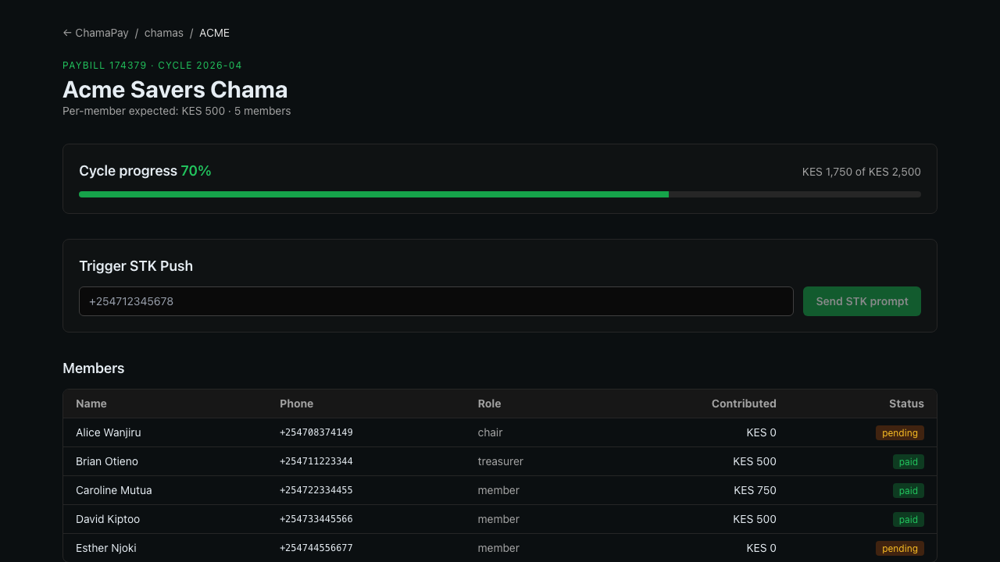

<p align="center">
  
</p>

# ChamaPay — demo script (90 seconds)

Reproduce the judges-facing demo from a clean clone. No Daraja, USSD, or blockchain credentials required — every external call has a local simulator path.

## 0 — Prereqs

- Node 18+ (tested on 25.9)
- `npm` (no pnpm/yarn needed)
- No Docker, no Postgres, no Redis required — SQLite is embedded.

## 1 — One-time setup (≈ 2 min)

```bash
git clone <this-repo>
cd Chama-Connect/chamapay
cp .env.example .env.local      # leave Daraja/AT/Anchor keys blank for the offline demo
npm install
npm run db:migrate              # creates var/chamapay.sqlite
npm run db:seed                 # inserts chama ACME + 5 members + April cycle
npm run dev                     # binds port 3100
```

Open [http://localhost:3100/chamas/ACME](http://localhost:3100/chamas/ACME).

You should see:



## 2 — The core demo (≈ 30 seconds)

Open a second shell. Simulate a correct payment — member's phone matches, account ref is well-formed:

**Bash/macOS/Linux:**
```bash
curl -sX POST http://localhost:3100/api/dev/simulate-c2b \
     -H 'content-type: application/json' \
     -d '{"msisdn":"254711223344","amount":500,"billRef":"ACME-202604"}' | jq
```

**PowerShell/Windows:**
```powershell
curl.exe -sX POST http://localhost:3100/api/dev/simulate-c2b -H 'content-type: application/json' `
     -d '{"msisdn":"254711223344","amount":500,"billRef":"ACME-202604"}' | ConvertFrom-Json | ConvertTo-Json -Depth 10
```

Expected response:

```json
{
  "payload": { "TransID": "SIM...", "TransAmount": "500.00", "MSISDN": "254711223344", ... },
  "result": {
    "status": "matched",
    "confidence": 1.0,
    "reason": "exact account-ref + msisdn match",
    "userId": "...",
    "chamaId": "...",
    "cycleId": "..."
  }
}
```

Switch back to the dashboard tab. Within 3 seconds, `Brian Otieno` flips from **pending** to **paid**, and the cycle-progress bar jumps.

## 3 — Showing reconciliation intelligence (≈ 30 seconds)

Three more simulated payments demonstrate the matcher:

**Bash/macOS/Linux:**
```bash
# Correct — matches Caroline by MSISDN even though ref has a typo
curl -sX POST http://localhost:3100/api/dev/simulate-c2b -H 'content-type: application/json' \
     -d '{"msisdn":"254722334455","amount":750,"billRef":"ACMMM-202604"}' | jq

# Unknown MSISDN + unknown prefix → lands in admin review queue
curl -sX POST http://localhost:3100/api/dev/simulate-c2b -H 'content-type: application/json' \
     -d '{"msisdn":"254799999999","amount":500,"billRef":"XYZ-202604"}' | jq

# Replay the first payment (same TransID) — idempotent, no double-credit
curl -sX POST http://localhost:3100/api/dev/simulate-c2b -H 'content-type: application/json' \
     -d '{"msisdn":"254711223344","amount":500,"billRef":"ACME-202604","transId":"<paste-previous-TransID>"}' | jq
```

**PowerShell/Windows:**
```powershell
# Correct — matches Caroline by MSISDN even though ref has a typo
curl.exe -sX POST http://localhost:3100/api/dev/simulate-c2b -H 'content-type: application/json' `
     -d '{"msisdn":"254722334455","amount":750,"billRef":"ACMMM-202604"}' | ConvertFrom-Json | ConvertTo-Json -Depth 10

# Unknown MSISDN + unknown prefix → lands in admin review queue
curl.exe -sX POST http://localhost:3100/api/dev/simulate-c2b -H 'content-type: application/json' `
     -d '{"msisdn":"254799999999","amount":500,"billRef":"XYZ-202604"}' | ConvertFrom-Json | ConvertTo-Json -Depth 10

# Replay the first payment (same TransID) — idempotent, no double-credit
curl.exe -sX POST http://localhost:3100/api/dev/simulate-c2b -H 'content-type: application/json' `
     -d '{"msisdn":"254711223344","amount":500,"billRef":"ACME-202604","transId":"<paste-previous-TransID>"}' | ConvertFrom-Json | ConvertTo-Json -Depth 10
```

Narration points for the demo video:

1. *"The engine matched Caroline by MSISDN alone, at 90% confidence — the ref was mistyped but the phone number was a unique hit."*
2. *"Random phone + unknown prefix — engine doesn't guess. It parks the payment in the admin review queue for the treasurer to resolve manually."*
3. *"Same TransID twice — engine returns `duplicate`, ledger unchanged. Safaricom's retry storms can't cause double-credits."*

## 4 — USSD demo (optional, ≈ 20 seconds)

Africa's Talking sandbox isn't required — the USSD handler can be fed directly:

**Bash/macOS/Linux:**
```bash
curl -sX POST http://localhost:3100/api/ussd \
     -d 'sessionId=demo&serviceCode=*384*1#&phoneNumber=%2B254708374149&text=' 
# → "CON ChamaPay — Acme Savers Chama
#     1. My balance
#     2. Contribute
#     3. Request loan
#     4. Recent payments
#     5. Exit"

curl -sX POST http://localhost:3100/api/ussd \
     -d 'sessionId=demo&serviceCode=*384*1#&phoneNumber=%2B254708374149&text=1'
# → "END Hi Alice. Contributed this cycle: KES 0. Expected: KES 500."
```

**PowerShell/Windows:**
```powershell
curl.exe -sX POST http://localhost:3100/api/ussd `
     -d 'sessionId=demo&serviceCode=*384*1#&phoneNumber=%2B254708374149&text='
# → "CON ChamaPay — Acme Savers Chama
#     1. My balance
#     2. Contribute
#     3. Request loan
#     4. Recent payments
#     5. Exit"

curl.exe -sX POST http://localhost:3100/api/ussd `
     -d 'sessionId=demo&serviceCode=*384*1#&phoneNumber=%2B254708374149&text=1'
# → "END Hi Alice. Contributed this cycle: KES 0. Expected: KES 500."
```

Every chama member — including those on feature phones who will never touch the web app — has full access.

## 5 — Tests (≈ 5 seconds)

```bash
npm test
```

6 reconciliation tests pass: exact match, idempotency, MSISDN fallback, unmatched path, balanced double-entry, mixed-format period parsing.

## 6 — Going live (for judges who want to wire up real Daraja)

Fill in `.env.local`:

```env
DARAJA_CONSUMER_KEY=<from developer.safaricom.co.ke>
DARAJA_CONSUMER_SECRET=<...>
DARAJA_CALLBACK_BASE=https://<your-ngrok>.ngrok.app
```

Register callback URLs once:

**Bash/macOS/Linux:**
```bash
curl -X POST http://localhost:3100/api/mpesa/c2b/register
# (internal helper — available in the admin chamas page too)
```

**PowerShell/Windows:**
```powershell
curl.exe -X POST http://localhost:3100/api/mpesa/c2b/register
# (internal helper — available in the admin chamas page too)
```

Then trigger a real STK Push from the dashboard "Trigger STK Push" card, or pay the sandbox paybill (`174379`) from an M-Pesa test account. The same reconciliation engine runs against live Daraja callbacks.

## Troubleshooting

- **Port 3100 in use** — `next dev -p 3200` and update `PUBLIC_BASE_URL`.
- **SQLite locked** — stop `npm run dev`, delete `var/chamapay.sqlite-journal`, restart.
- **Tests flaky** — each test uses its own `os.tmpdir()` SQLite file, so this shouldn't happen; if it does, the tmpdir is stale and can be cleared.
